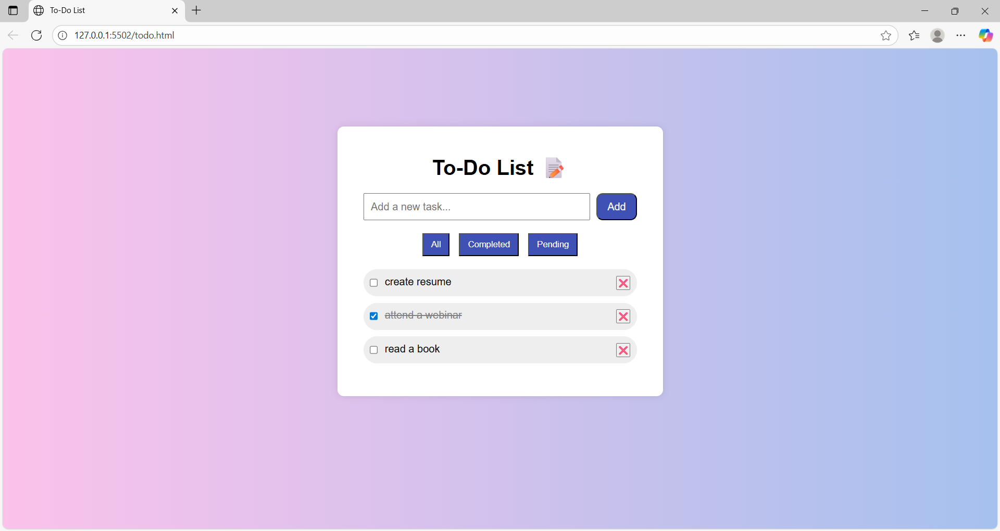

---

# 📝 To-Do List Web App

A clean, modern, and responsive **To-Do List** web application built with **HTML, CSS, and JavaScript**. This app helps users manage their daily tasks by allowing them to **add**, **complete**, **delete**, and **filter** tasks using a beautiful interface.

---

## 🚀 Features

- ✅ Add new tasks
- ✔ Mark tasks as completed
- 🗑 Delete tasks
- 🔎 Filter by:
  - All
  - Completed
  - Pending
- 📱 Fully responsive and mobile-friendly
- 🎨 Beautiful UI with:
  - White glass-style task container
  - Blue buttons
  - Gradient background

---

## 📸 Screenshots

  

---

## 🛠 Tech Stack

- **HTML5** – for structure
- **CSS3** – for layout and styling
- **JavaScript** – for dynamic functionality

---

🙋‍♀ Author

Built with ❤ by Saranya Kuchimanchi

---

---
